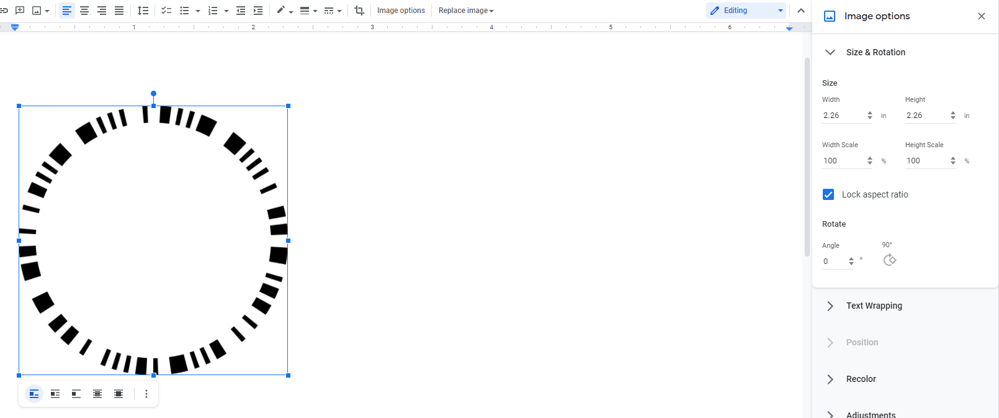

# Nespresso Vertuo Barcode Generator
This project aims to decode and generate printable barcodes for the Nespresso's Vertuoline machines. Of course the barcodes aren't guaranteed to work, and i'm not responsible for any broken machines. Though I can't fathom how you could possibly break one.

## Setup
1. Download the latest version of python [here](https://www.python.org/downloads/). Or at least have version 3.7 or greater.
2. Install Pillow through `pip install Pillow`
3. Download this project either in the Release section, or though `git clone https://github.com/arandomdev/NespressoBarcodes.git`
4. Open a terminal inside the project folder.

# Usage
This project has two scripts, the generator and printer.

## The generator
The generator takes a simplified form of a pod's code called the ID to generate a code that can be passed to the printer. The ID has 4 segments of 1s and 0s, for example "1100 1101 0100 001101"

Here is a table of IDs from various tags (Thanks to [u/UnknownCofeeDrinker](https://www.reddit.com/user/UnknownCofeeDrinker/)). I found that you can mix segments from various IDs and still get a working barcode. Its just that I don't know what all the segments do.

| Name                   |Water Quantity| Segment 1 | Segment 2 | Segment 3 (Water quantity?) | Segment 4 |
|------------------------|--------------|-----------|-----------|-----------------------------|-----------|
| Alto Intenso           | 414 ml       | 1001      | 0010      | 1000                        | 010110    |
| Alto Dolce             | 414 ml       | 1111      | 0100      | 1000                        | 010110    |
| Giorno                 | 230 ml       | 1010      | 1110      | 0100                        | 001000    |
| Colombia               | 230 ml       | 1100      | 0001      | 0010                        | 010110    |
| Melozio                | 230 ml       | 1100      | 1101      | 0100                        | 010110    |
| Odacio                 | 230 ml       | 1100      | 0010      | 0100                        | 010110    |
| Stormio                | 230 ml       | 1100      | 0010      | 0100                        | 010110    |
| Madeline               | 230 ml       | 1010      | 0010      | 0100                        | 010110    |
| Vanizio                | 230 ml       | 1100      | 1101      | 0100                        | 010110    |
| Decaffeinato           | 230 ml       | 1001      | 1110      | 0100                        | 001000    |
| Blanco Forte           | 230 ml       | 1111      | 0100      | 0010                        | 010110    |
| Aflorazio              | 150 ml       | 1010      | 1000      | 1110                        | 001110    |
| Fortado                | 150 ml       | 1111      | 1011      | 1110                        | 001110    |
| Double Expresso Scuro  | 80 ml        | 1010      | 1011      | 0001                        | 001110    |
| Double Expresso Chiaro | 80 ml        | 1100      | 1011      | 0001                        | 001110    |
| Blanco Leggero         | 80 ml        | 1111      | 1101      | 0001                        | 001110    |
| Diavolito              | 40 ml        | 1001      | 1101      | 1011                        | 001101    |
| Altissio               | 40 ml        | 1010      | 1101      | 1011                        | 010101    |
| Deca Intenso           | 40 ml        | 1010      | 0010      | 1011                        | 010101    |
| Paris Black            | 40 ml        | 1100      | 1000      | 1011                        | 001101    |
| Voltesso               | 40 ml        | 1001      | 0010      | 1011                        | 010101    |


For example, say I wanted to use Melozio's code but with only 40 ml of water, I can do this.
```console
> python generator.py 1100 1101 1011 010110

Output
01110010110110101110010110010111001011010110110101011010011100011101101011010101100101110001110101101101010110010111000111010110111001011010

```

## The printer
The printer takes a code and turns it into a printable image. The code should be 140 characters consisting of only 1s and 0s.

In the following example, each call is a single line, including the code.
```console
> python printer.py 01110010110110010010001101010111001011010101000100110110011100011101100100010011010101110001110101010001001101010111000111010101001000110110

> python printer.py -o outputPath.png 01110010110110010010001101010111001011010101000100110110011100011101100100010011010101110001110101010001001101010111000111010101001000110110
```

# Printing and Testing
After getting an image from the printer script, you can print it and test it out. But there are a few things you need to do before that.

1. import the image into a program like Google Docs, where you can control the size of the image. For Google Docs, drag the image into a blank document, click on the image and then "Image Options", and under "Size & Rotation" set the width to 2.26in


2. Print out the image and cut out the barcode.

3. Using a fine sharpie or black pen, go over the black sections to darken them. Without this step, my machine would not read the barcode.

4. Test it out!


# Helpful links
* https://www.reddit.com/r/nespresso/comments/d9xnv9/breaking_the_nespresso_vertuo_barcodes/
* https://www.reddit.com/r/nespresso/comments/okc1vx/breaking_the_nespresso_vertuo_barcodes_part_2/